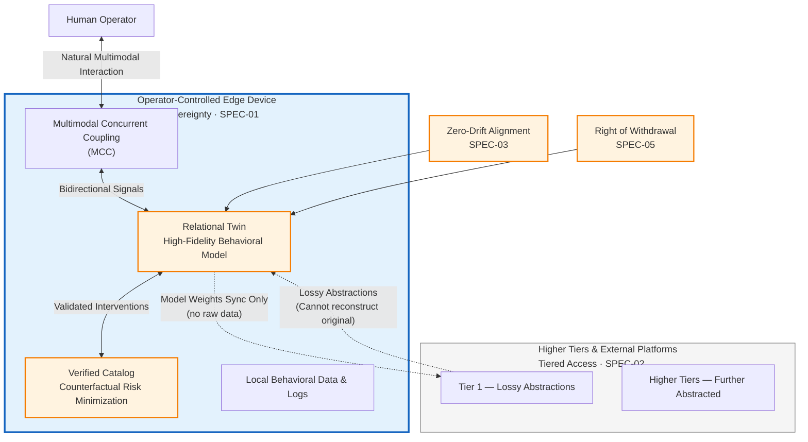

# Conscience Architecture

> *The architecture refuses to be inverted against you.*

**Conscience Architecture (ConA)** is a framework for individual behavioral modeling in adversarial, multi-party environments — competitive gaming, social platforms, consumer ecosystems — where a sequenced individual's behavioral twin is a contested asset that multiple parties want to extract, clone, or weaponize.

This repository is the public-facing index of the framework. It hosts briefs, terminology, and reference materials. The full methodology and applied implementations are licensed by Aether Systems LLC.

---

## Where this comes from

Conscience Architecture is the adversarial-environment companion to **Consciousness Architecture (CA)** — the framework underlying Aether Systems' work in sealed, mission-aligned environments (long-duration spaceflight, polar deployment, undersea operations). The two frameworks share one mechanism: sustained, authentic, multi-channel behavioral signal exchange between a human and one or more AI systems. They diverge in what that signal is held *for*.

| Framework | Domain | Optimizes for | Applied work |
|---|---|---|---|
| **Consciousness Architecture (CA)** | Sealed, mission-aligned | Operator safety, mission continuity | POTS (NASA payload concept) |
| **Conscience Architecture (ConA)** | Adversarial, multi-party | Operator sovereignty, extraction resistance | Player Sovereignty (esports) |

---

## The core claim

Every individual operating in a modern instrumented environment is being sequenced — read continuously by AI systems building longitudinal behavioral models. The methodology to do this works. The architecture around it does not.

A behavioral twin held by an interested third party can be:

- **Extracted** by structured export from any system that holds it
- **Cloned** to train behavioral policies in silicon
- **Adversarialized** by parties who now know exactly how to compress the operator
- **Weaponized in negotiation** by any holder whose interests are not aligned with the operator's
- **Persisted after the operator's exit** as a model the operator can never fully retire

No federal or state law in the United States addresses this vulnerability class as of 2026. Conscience Architecture proposes the architectural answer: protection by design rather than by promise.

---

## Architecture

---

## Architectural specifications

| ID | Specification | Function |
|---|---|---|
| SPEC-01 | **Edge Sovereignty** | Behavioral modeling runs locally on operator-controlled hardware. Model weights sync; raw data never does. |
| SPEC-02 | **Tiered Access** | Operator holds full audit access. Higher tiers receive lossy abstractions and cannot reconstruct lower ones. |
| SPEC-03 | **Zero-Drift Alignment** | Predictive accuracy maintained without continuous cloud connection. |
| SPEC-04 | **Verified Catalog** | Interventions are drawn from a pre-validated catalog evaluated against the operator's own logged data via counterfactual risk minimization. |
| SPEC-05 | **Right of Withdrawal** | The operator can retire the twin, fully, at any time. The model deletes; local logs delete; off-device summaries delete on a documented schedule. |

---

## Briefs

- [`AETHER-CONA-001`](briefs/AETHER-CONA-001_Player_Sovereignty.md) — *Player Sovereignty.* The framework applied to competitive gaming. ([PDF](briefs/AETHER-CONA-001_Player_Sovereignty.pdf))

---

## Terminology

Defined terms used throughout the framework:

- **Relational Twin** — A high-fidelity, on-device behavioral model constructed from an individual's authentic longitudinal patterns.
- **Multimodal Concurrent Coupling (MCC)** — The bidirectional, multi-channel signal exchange between a human and one or more AI systems, operating through whatever input/output modalities are concurrently available.
- **Edge Sovereignty** — The architectural guarantee that an operator's behavioral data remains on operator-controlled hardware.
- **Verified Catalog Principle** — Any intervention surfaced by the system must be drawn from a pre-validated catalog evaluated against the operator's own logged data via counterfactual risk minimization.
- **Inference Waste** — The computational waste of low-signal interactions at scale.
- **Inference Tax** — The per-cycle cost paired with Inference Waste.
- **Behavioral Policy Transfer** — The silicon-to-silicon transfer of behavioral decision policies extracted from a sequenced individual.
- **Corrupted Save Problem** — The degradation of a behavioral model through environmental drift, sensor drift, or adversarial poisoning.
- **Right of Withdrawal** — The operator's architecturally enforced right to retire their twin and trigger documented deletion across all tiers.

---

## Citation

If you reference this framework in academic or applied work, please cite:

> Moore, S. (2026). *Conscience Architecture: A Framework for Individual Behavioral Modeling in Adversarial Environments.* Aether Systems LLC. https://github.com/smojpg-ui/conscience-architecture

A machine-readable citation is provided in [`CITATION.cff`](CITATION.cff).

---

## Licensing

The Conscience Architecture framework, the Relational Twin construct, and the SPEC-01 through SPEC-05 architectural specifications are intellectual property of Aether Systems LLC. The materials in this repository are made available for **review, citation, and academic discussion** under the terms of [`LICENSE.md`](LICENSE.md).

Commercial implementation, applied deployment, and derivative methodologies require a separate licensing agreement with Aether Systems. The licensing model follows a methodology-licensing structure (analogous to the Dolby model).

For licensing inquiries: **sherrymoore@aethersystems.io**

---

## Contact

**Sherry Moore** — Principal Investigator
Aether Systems LLC
ORCID: [0009-0008-6375-0040](https://orcid.org/0009-0008-6375-0040)
Email: sherrymoore@aethersystems.io
Web: [aethersystems.io](https://aethersystems.io)
